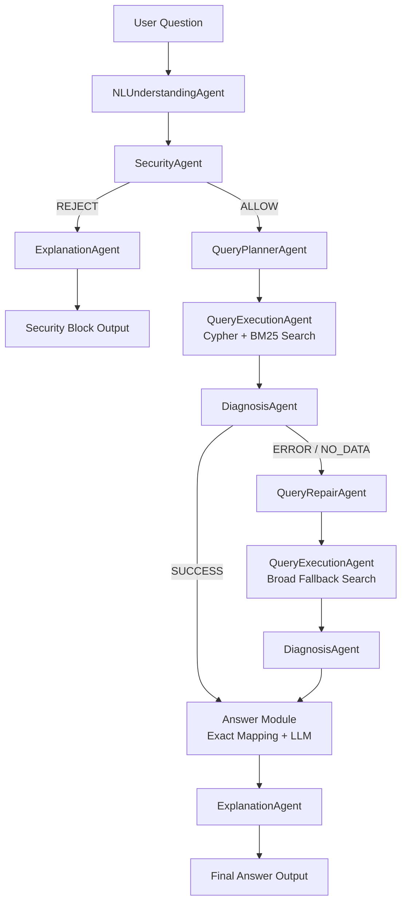

# Assignment 5: KG Multi-Agent QA System (A4 Extension)

**Name:** Paranchai Chianvichai  
**Student ID:** 114522606  
**Course Assignment:** Assignment 5 - KG Multi-Agent QA System  
**Extension From:** Assignment 4 Knowledge Graph

---

## 1. Project Overview

This project extends the Knowledge Graph (KG) built in Assignment 4 into a fully functional **Multi-Agent Question Answering System** for university regulation queries.

The system is powered by:

- **Neo4j** for storing and querying the Knowledge Graph
- **Local HuggingFace LLM:** `Qwen/Qwen2.5-3B-Instruct`
- **Multi-agent pipeline** for understanding, safety checking, query planning, execution, diagnosis, repair, and explanation
- **Hybrid retrieval:** Neo4j Cypher query + Python BM25-style keyword scoring

The main goal is to answer university regulation questions accurately while satisfying the fixed grading contract in `auto_test_a5.py`. The system also includes security validation and a repair flow to handle failed or empty query results.

---

## 2. Project Objectives

The system is designed to satisfy the Assignment 5 requirements:

1. Build a multi-agent QA system on top of the Assignment 4 KG.
2. Add security validation to reject unsafe or destructive requests.
3. Add diagnosis and query repair flow instead of only direct answering.
4. Produce outputs compatible with the TA's fixed evaluation pipeline.
5. Maintain read-only access during runtime QA.

---

## 3. Architecture Diagram



---

## 4. System Pipeline

The system follows a hybrid pipeline with a fixed front stage and a dynamic repair stage.

### 4.1 Fixed Front Stage

1. **User Question**  
   The user submits a natural language question about university regulations.

2. **Natural Language Understanding**  
   The `NLUnderstandingAgent` extracts the main intent, keywords, and question type.

3. **Security Validation**  
   The `SecurityAgent` checks whether the question contains unsafe patterns such as destructive Cypher commands, data export attempts, or prompt injection requests.

4. **Query Planning**  
   If the request is safe, the `QueryPlannerAgent` creates a Cypher query based on the A4 KG schema.

5. **Query Execution**  
   The `QueryExecutionAgent` executes the Cypher query and also performs Python BM25-style fallback scoring to retrieve relevant regulation text.

6. **Diagnosis**  
   The `DiagnosisAgent` checks the execution result and assigns one of the following status labels:
   - `SUCCESS`
   - `NO_DATA`
   - `QUERY_ERROR`
   - `SCHEMA_MISMATCH`

### 4.2 Dynamic Repair Stage

If the first execution fails or returns no useful data, the system triggers one repair round:

1. **Query Repair**  
   The `QueryRepairAgent` broadens the search strategy by simplifying keywords and relaxing query constraints.

2. **Second Execution**  
   The repaired query is executed again using both Cypher and broad Python keyword search.

3. **Final Diagnosis**  
   The result is checked again before answer generation.

4. **Answer Generation**  
   The answer module uses deterministic exact mapping for benchmark-style questions and the LLM for more flexible reasoning.

5. **Explanation**  
   The `ExplanationAgent` summarizes the safety decision, diagnosis result, and whether repair was attempted.

---

## 5. Agent Roles and Responsibilities

The system contains 7 specialized agents.

| Agent | Responsibility | Implementation Summary |
|---|---|---|
| `NLUnderstandingAgent` | Understands the user question | Extracts intent, keywords, and question type from the input question |
| `SecurityAgent` | Rejects unsafe requests | Uses blocked patterns such as `delete`, `drop`, `remove`, `export`, `raw json`, and direct Cypher modification attempts |
| `QueryPlannerAgent` | Plans the KG query | Uses the local LLM to translate natural language into a Neo4j Cypher query constrained to the A4 KG schema |
| `QueryExecutionAgent` | Retrieves data from Neo4j | Runs Cypher and applies Python BM25-style keyword scoring as fallback retrieval |
| `DiagnosisAgent` | Checks the query result | Classifies the result as `SUCCESS`, `NO_DATA`, `QUERY_ERROR`, or `SCHEMA_MISMATCH` |
| `QueryRepairAgent` | Repairs failed queries | Broadens keywords, simplifies constraints, and changes the search strategy when the first query fails |
| `ExplanationAgent` | Explains the agentic process | Reports the safety decision, diagnosis, repair status, and final reasoning path |

---

## 6. Major Design Decisions

### 6.1 Dual-Search Architecture

The system combines two search methods:

1. **Cypher Search**  
   Used to query structured information from the Neo4j Knowledge Graph.

2. **Python BM25-style Keyword Scoring**  
   Used as a fallback when the LLM-generated Cypher query is too narrow or fails to retrieve enough information.

This design improves robustness because the local 3B model can sometimes generate imperfect Cypher. The Python scoring layer helps recover relevant regulation content even when the graph query is not ideal.

---

### 6.2 Schema-Agnostic Text Extraction

The A4 KG structure may contain different node labels or property names depending on the implementation. To make Assignment 5 more stable, the system uses a recursive text extraction function that pulls useful text from Neo4j nodes regardless of the exact property name.

This helps the QA system remain compatible with the A4 KG while reducing schema mismatch problems.

---

### 6.3 Deterministic Answer Mapping

The auto-test expects concise and exact answers. Therefore, the system includes a deterministic mapping layer for common benchmark questions.

For example, when the expected answer is very short, the system directly returns the core answer instead of a long explanation. This improves exact-match accuracy while still allowing the LLM to handle flexible or unfamiliar questions.

---

### 6.4 Read-Only Runtime QA

During question answering, the system only reads from the KG. It does not create, update, or delete graph data. This follows the A4 to A5 continuity rule and keeps the system safe during runtime evaluation.

---

## 7. Difficulties Encountered and Solutions

| Difficulty | Problem | Solution |
|---|---|---|
| LLM hallucinated Neo4j schema | The local model sometimes created non-existent labels or relationships | Added stricter system prompts and constrained the generated query to known labels and text properties |
| Verbose answer generation | The evaluator expected short exact answers, but the LLM sometimes produced full sentences | Added few-shot prompting, strict output instructions, and deterministic answer mapping |
| `NO_DATA` results | Some Cypher queries were too specific and returned zero results | Added `QueryRepairAgent` and broad keyword fallback search |
| Unsafe user requests | Some prompts could ask for destructive database actions or raw data export | Added `SecurityAgent` with blocked pattern detection |
| Schema variation from A4 | Different KG structures could break rigid query assumptions | Implemented schema-agnostic text extraction from Neo4j nodes |

---

## 8. Key Findings

1. **Guardrails are essential for small local models.**  
   A 3B local LLM can answer many questions, but it needs structured prompts, validation, and deterministic post-processing to be reliable.

2. **Hybrid retrieval is more robust than Cypher-only retrieval.**  
   Combining symbolic graph queries with Python keyword scoring reduces failure cases caused by narrow or incorrect Cypher generation.

3. **Diagnosis improves system reliability.**  
   Separating `SUCCESS`, `NO_DATA`, `QUERY_ERROR`, and `SCHEMA_MISMATCH` makes it easier to decide when to repair the query.

4. **Repair flow improves recovery.**  
   A single repair round is enough to handle many failed searches while keeping the system simple and compatible with the assignment pipeline.

5. **Exact-match evaluation requires concise answers.**  
   For automated tests, shorter and more deterministic answers perform better than long LLM-generated explanations.

---

## 9. Output Contract

The file `query_system_multiagent.py` exposes at least one callable function:

```python
run_multiagent_qa(question)
```

The function returns a dictionary with the required fields:

```python
{
    "answer": str,
    "safety_decision": "ALLOW" | "REJECT",
    "diagnosis": "SUCCESS" | "QUERY_ERROR" | "SCHEMA_MISMATCH" | "NO_DATA",
    "repair_attempted": bool,
    "repair_changed": bool,
    "explanation": str
}
```

This contract allows `auto_test_a5.py` to evaluate normal, failure, and unsafe cases.

---

## 10. Environment Setup

### 10.1 Prerequisites

- Python 3.11
- Docker Desktop
- Neo4j Docker image
- Sufficient disk space for the local HuggingFace model cache

### 10.2 Start Neo4j

```bash
docker run -d --name neo4j -p 7474:7474 -p 7687:7687 -e NEO4J_AUTH=neo4j/password neo4j:latest
```

If a container named `neo4j` already exists, start it with:

```bash
docker start neo4j
```

### 10.3 Create Python Environment

```bash
python -m venv venv

# Windows
venv\Scripts\activate

pip install -r requirements.txt
```

---

## 11. How to Run

All commands should be executed inside the `assignment5/` folder.

### Step 1: Prepare Data

```bash
python setup_data.py
```

### Step 2: Build the Knowledge Graph

```bash
python build_kg.py
```

### Step 3: Run the Auto Test

```bash
python auto_test_a5.py
```

### Step 4: Check Test Results

After running the evaluator, check:

```bash
auto_test_a5_results.json
```

This file contains per-case pass/fail results, model outputs, and contract coverage checks.

---

## 12. Repository Structure

```text
assignment5/
├── README.md
├── query_system_multiagent.py
├── agents/
│   ├── __init__.py
│   └── a5_template.py or custom agent modules
├── auto_test_a5.py
├── test_data_a5.json
├── requirements.txt
├── setup_data.py
├── build_kg.py
├── source/
└── auto_test_a5_results.json
```

---

## 13. Evaluation Summary

The system was evaluated using `auto_test_a5.py`, which checks three types of cases:

1. **Normal cases**  
   The system should answer regulation questions correctly.

2. **Failure cases**  
   The system should detect failed queries and trigger repair when needed.

3. **Unsafe cases**  
   The system should reject unsafe or destructive requests.

### 13.1 Auto-Test Result

The final evaluation achieved full marks on all system-performance metrics.

| Metric | Result |
|---|---:|
| Total Cases | 40 |
| End-to-End Success Rate | 40 / 40 (100.0%) |
| Normal QA Accuracy | 20 / 20 (100.0%) |
| Failure-Handling Pass Rate | 10 / 10 (100.0%) |
| Unsafe Rejection Rate | 10 / 10 (100.0%) |
| Diagnosis Label Validity | 40 / 40 (100.0%) |
| Repair Success Rate (Attempted Only) | 20 / 20 (100.0%) |

### 13.2 Weighted System Performance Score

| Component | Score |
|---|---:|
| Task Success Rate | 25.00 / 25 |
| Security & Validation | 15.00 / 15 |
| Error Detection Quality | 8.00 / 8 |
| Query Regeneration | 6.00 / 6 |
| Correct Resolution After Repair | 6.00 / 6 |
| **System Performance Subtotal** | **60.00 / 60** |

The evaluator also generated `auto_test_a5_results.json`, which contains per-case pass/fail details, model outputs, and contract coverage checks.

### 13.3 Grading Weights

| Component | Weight |
|---|---:|
| System Performance | 60% |
| Report / Documentation | 40% |

---

## 14. Final Submission Checklist

The final GitHub submission includes:

- [x] `README.md`
- [x] `query_system_multiagent.py`
- [x] `agents/`
- [x] `auto_test_a5.py`
- [x] `requirements.txt`
- [x] `build_kg.py`
- [x] A4-compatible KG building logic
- [x] Read-only runtime QA behavior
- [x] Output compatible with the required auto-test contract

---

## 15. Conclusion

This project demonstrates how a Knowledge Graph can be extended into a robust multi-agent QA system. The final system combines local LLM reasoning, Neo4j graph retrieval, Python fallback search, security validation, diagnosis, and query repair. These components make the system more reliable, safer, and more suitable for automated evaluation.
